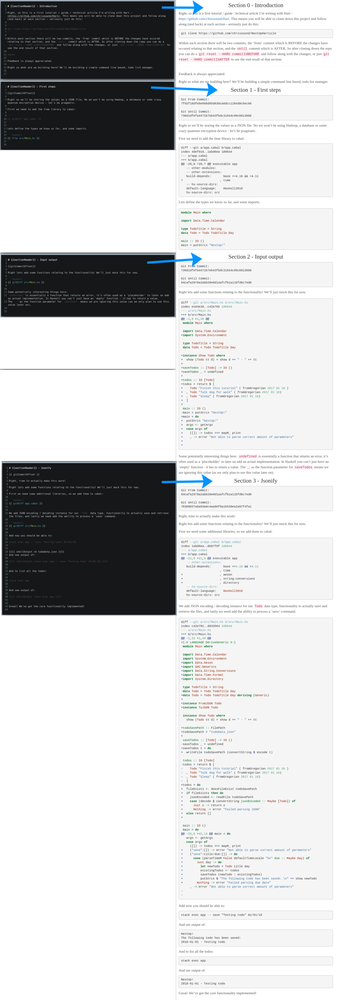

A [DSL](https://en.wikipedia.org/wiki/Domain-specific_language) which combines literate programming, git and reproducibility.

## What problem does this solve?

Within the context of a git commit:

- Allows you to reference source code (example: lines 7-9 from file `example/path/file.txt`)
- Run shell commands and capture their output 
- Allows you to easily edit documents - a bit difficult to explain this, for example if you decide to rename a variable, you can just go to the specific commit, modify it, and use native git to propagate the change upwards - and in the end run it again to make sure it all works!)

## Vision / Goals

I'd love to see a world where we have learning resources/documentation for programmes that can be verifiably run / tested. Or even keep an entire "programming book" up to date with the latest changes.

### TLDR

Write excellent programming tutorials / technical articles / blog posts, automate copying / pasting of commands and output, and automate taking screenshots (or anything really - as long as it can be triggered by a shell command).

You know where you write a tutorial and you say run this command `sudo whoami`, and then you copy and paste the output? And then you realize that `sudo` isn't installed?  Well how about just automate and verify this with something like:

```
{{shellOut sudo whoami}}
```

## Project structure 

A chapter file can reference one or more consecutive commits, they also need to be 0 indexed.

```
0_Chapter.md / commit1
             / commit2
             / commit3
1_Chapter.md / commit4
             / commit5
2_Chapter.md / commit6
             / commit7
```

## How to modify a previous commit / chapter
#### Step 1 - checkout the commit you want to modify:
```
editCommit="commitYouWantToEdit"
git checkout "$editCommit"
```

#### Step 2  - make your changes

#### Step 3  - git rebase!
`git commit -a --amend && git checkout - && git rebase --onto @{-1} "$editCommit"`

#### Step 4 (Optional) fix conflicts
You'll need to resolve any conflicts as your change propagates through the parent commits.

#### Step 5
`git push --force`
Force push the repo. Yes a force push is required because we need to overwrite the "history" of the repo.

## Diagram / demo illustratino: 

On the left we have the chapter files, on the right is the rendered output in HTML in a browser.



## Similar projects of potential interest

- https://jupyter.org/
- http://howardism.org/Technical/Emacs/literate-devops.html
- https://byorgey.wordpress.com/blogliterately/
- http://www.andrevdm.com/posts/2018-02-05-hakyll-code-build-include-compiler.html

## Supported functionality:

`{{ chapterHeader }}` returns the text `Chapter x` where x is the chapter number.

`{{ gitDiff path/to/file.sh }}` returns the `git diff` of file.

`{{ file path/to/file.sh }}` returns the content of file.

`{{ fileSection path/to/file.hs main }}` like `file` but returns a section from a file based on comment delimiters (thanks to https://github.com/owickstrom/pandoc-include-code).

`{{ gitCommitOffset }}` returns a chapter commit reference

### Shell functions
 
Where `...` is the command you want to run

`{{ shell ...}}`
- continue regardless of the exit status

`{{ shell' ...}}`
- continue only if it returns success (0 exit code) 

`{{ shellOut ...}}` 
- show output (stdout / stderr)
- continue regardless of the exit status

`{{ shellOut' ...}}` 
- show output (stdout / stderr)
- continue regardless of the exit status


```
{{{ghci optionalSessionId
:t head
4+4
}}}
```
related to Haskell, will run the code within a GHCi session and output the results (thanks to https://github.com/byorgey/BlogLiterately). The optionalSessionId is a random string you can choose to 'persist' a GHCi process between tags.


## Limitations

- The branch that will be rendered is hardcoded to be `master`
- Modifying old chapters requires doing a git rebase on that project - which may present some difficulty for the usual git collaberation (as you are basically rewriting git repo history). However changes can be shared by using additional git branches.

## Installation

Either of these should work:

    stack install gitchapter:exe:gitchapter
    nix-env -if default.nix
    nix-env -if "https://github.com/chrissound/GitChapter/archive/master.tar.gz"

## How do I create a project that can be rendered?

#### Step 1 - Create an appropriate repository
Create a chapter file `chapters/x_Example.md` file with your relevant commits, where `x` is a 'chapter' number (it uses 0 based indexing - the first chapter should be named `0_..`). The chapter file needs to be committed alongside the commits relating to things like source code etc.

#### Step 2 - Render
You can then render a project by executing:
`gitchapter /path/to/project` - this will generate a `compiledArticle.md` file by iterating through all commits in the repo, and compiling their associated chapter files.

Note:
Using <https://github.com/jgm/pandoc> will allow you to generate HTML (or other formats) from markdown with a simple command like:
`pandoc --from markdown_strict+backtick_code_blocks -s compiledArticle.md -o compiled.html`

### Example 'GitChapter' projects:

- https://github.com/chrissound/NextUpHarticle
  Output available at: https://github.com/chrissound/NextUpHarticle/blob/master/compiledArticle.md

- https://github.com/chrissound/GentleIntroductionToMonadTransformers
  Output available at: https://trycatchchris.co.uk/post/view/Hart-article-A-Gentle-Introduction-To-Monad-Transformers


## Need help?
As this is a new project, if you hit any issues or need help setting anything up - please don't hesitate to post a Github issue! :smile: 

## Concepts

### Chapter

A single file defined in the `chapters/` directory with an `index` followed by an underscore. I may have referenced this as a "section" previously as well as in source code.

### Chapter commit reference

Each chapter can reference one or more consecutive git commits. The offset determines the start and end commits. Commits will automatically be tagged with `ghc-begin-x` and `ghc-end-x`. This is what allows someone to checkout a commit relating to a specific chapter.
