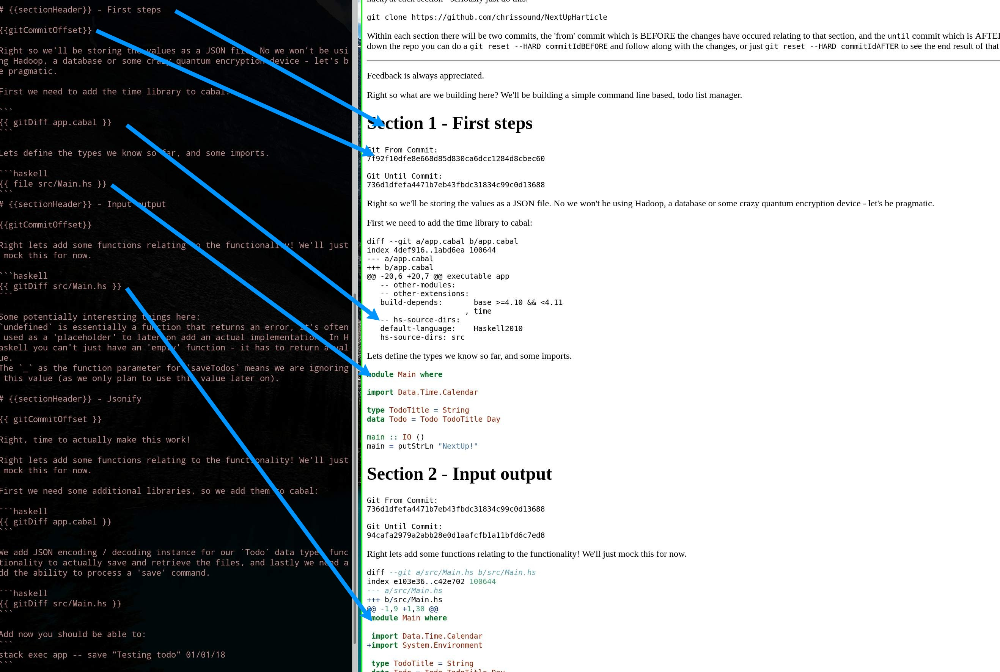

# Hart

## What problem does this solve?
Makes it easy to write technical article  while including files as annotations. Allows you to associate a file (format agnostic) with a set of commits within a git repository.

So something along the lines of
```
Section1.md / commit1
            / commit2
            / commit3
Section2.md / commit4
            / commit5
Section3.md / commit6
            / commit7
```


### Supported tags / features:

`{{sectionHeader}}` which would be `Secton x` where x is the section number.

`{{ gitDiff path/to/file.sh }}` which would show you a `git diff` of file relative to the section's 'parent commit'.

`{{ file path/to/file.sh }}` which would show you entire content of file relative to the section's 'parent commit'.

`{{gitCommitOffset}}` will output the seciton's commit 'range'.

`{{{{ shellOutput command goes here }}}}` which would execute `command goes here` (in your shell) and output whatever is returned.


## Limitations
Not 100% tested - but the core functionality (secitons?) works! 

## Instructions
Create a `sections` directory in a git repository. Create a `x_Example.md` file, where x is a 'section'. Commit this section file along with your code. 

## Example 'project'

https://github.com/chrissound/NextUpHarticle

Output available at:
https://github.com/chrissound/NextUpHarticle/blob/master/compiledArticle.md



## Installation

Most probably you would need to install Haskell / GHC (the Haskell compiler). You can then 'compile' a project by doing:
`stack exec app -- /path/to/project`. It should be possible to provide a binary / docker image for this - but I'll need to figure out how to do this.
